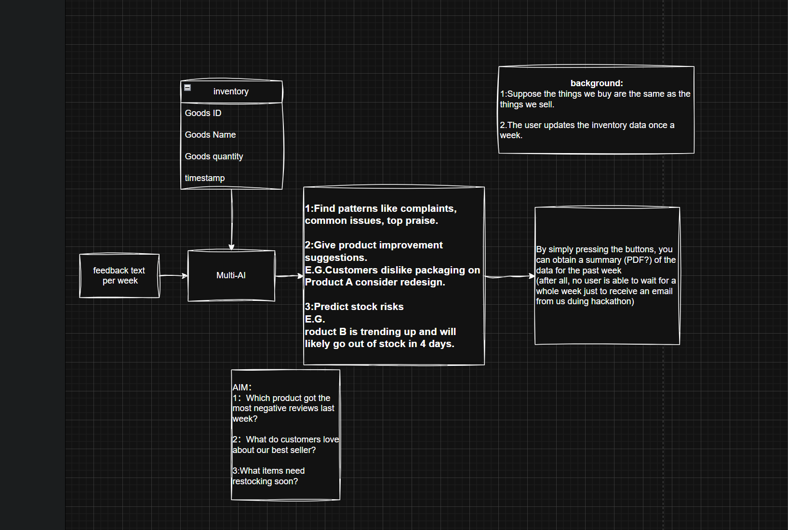
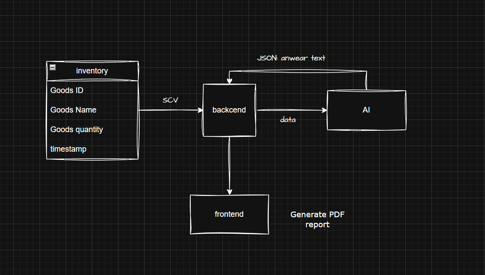

# 🛒 Ecom Insight Agent  
### AI-Powered Product Review & Inventory Assistant for E-Commerce Teams

---

## 🧠 Description

**Ecom Insight Agent** is a web-based AI agent designed to empower e-commerce businesses with **deep product insights**, **faster decision-making**, and **proactive inventory management**.

Built with cutting-edge tools like **Llama 3.1 (on Groq)**, **Snowflake**, and optionally **Coral Protocol**, this platform processes review + inventory data to help teams:

- Analyze customer feedback at scale
- Predict stock risks
- Answer product-related business questions  
All through a **friendly natural language interface**.

Deployed on **Vultr**, it offers a **cloud-native, scalable** solution for real-world enterprise use.

---

## 🎯 Key Features

### ✅ Smart Review Analyzer  
Understand what customers **love**, **complain about**, or **suggest** — even across thousands of product reviews.

### 📉 Stock Risk Predictor  
Identify which products are trending, likely to sell out, or require urgent restocking.

### 💬 Ask-the-Agent Interface  
Use natural questions like:
- “What are top complaints for Product X?”
- “Which items may sell out next week?”
- “Summarize review trends for this month.”

### 🔍 LLM-Powered Insight  
Using **Llama 3.1 on Groq**, the agent provides fast, high-quality reasoning and summarization.

### ☁️ Cloud-Hosted & Scalable  
- Hosted on **Vultr**
- Inventory/review data in **Snowflake**
- Secure, enterprise-grade performance

---

## 🔧 Tech Stack

| Layer | Technology |
|-------|------------|
| Language Model | Llama 3.1 via Groq |
| Data Source | Snowflake (inventory + feedback) |
| Agent Logic | Python + custom reasoning |
| UI | Streamlit or Flask |
| Deployment | Vultr Cloud |
| Optional | Coral Protocol, Fetch.ai |

---

## 👥 Ideal Users

- E-commerce product managers  
- Inventory and ops teams  
- Customer success analysts  
- Business analysts & marketers

---

## 🚀 Example Use Case

You upload:  
📁 `weekly_reviews.csv` + `inventory_data.csv`

You ask:  
> “What’s hurting sales for Product B?”

AI Agent replies:  
> "Many reviews mention **delayed shipping** and **poor packaging**. Stock levels are also **low**, which may hurt future sales."

🎯 Bonus:  
> Suggests **restocking now** and **updating product packaging**.

---

## 🧭 Architecture Overview

### 🖼️ System Diagram 1 – User Goals & Logic Flow  

---

### 🖼️ System Diagram 2 – Technical Data Flow  

---

## 📌 Summary

| Feature | Value |
|---------|-------|
| 🔎 Review Analysis | Find patterns like complaints, praise, or bugs |
| 📦 Inventory Forecasting | Prevent stockouts before they happen |
| 🧠 LLM Answers | Ask product questions in plain English |
| 📄 PDF Generator | One-click report for team decision-making |

---

> Built for Hackathons. Ready for Production.
